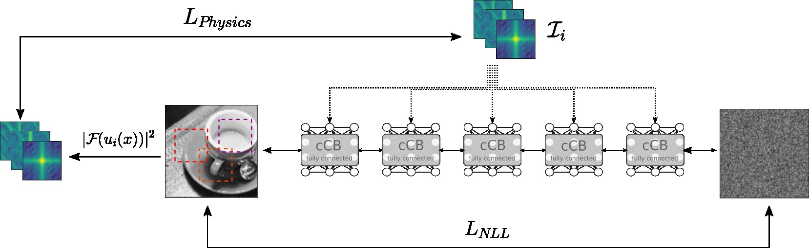

We are developing a one-step approach that inverts X-ray diffraction images in real-time during experiments at synchrotrons like [DESY](https://desy.de) or our [HIBEF](https://www.hzdr.de/db/Cms?pOid=50566&pNid=694) beamline at [EuropeanXFEL](https://www.xfel.eu). Due to the loss of phase information during the scattering process, there are multiple solutions for each diffraction pattern which is why we use the conditional Invertible Neural Network which shows all possible solutions in a probability density distribution. This approach is trained with a data-driven loss to learn a relationship between diffraction pattern and reconstructed target. The simulated training data has to be perturbed in a way that resembles the artifacts during the experiment.

The library **nfPhasing** extends the data loss with physics-driven methods in order to refine results or iteratively reach a solution completely unsupervised. 

The general idea is that a conditional Normalising Flow is learning a mapping from experimentally acquired diffraction pattern(s) **I** and some prior distribution to the predictive posterior distribution of electron densities **u**. The neural network is trained by a data-driven objective as well as a Physics-based loss. The former allows for very fast inference (i.e. reconstruction) on data similiar to our training data while the latter enables reconstruction of objects that are out-of-distribution to the training data.

**nfPhasing** is covering the following modalities:
- 1d/2d Small-angle X-ray scattering (at Grazing Incidence)
- 2d Ptychography
- 2d Holography / Phase Contrast Imaging

# Team
* Nico Hoffmann
* Erik Thiessenhusen
* Maksim Zhdanov
